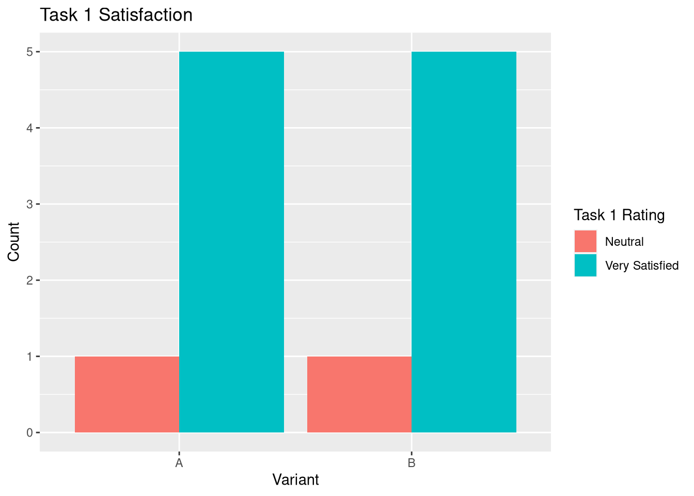
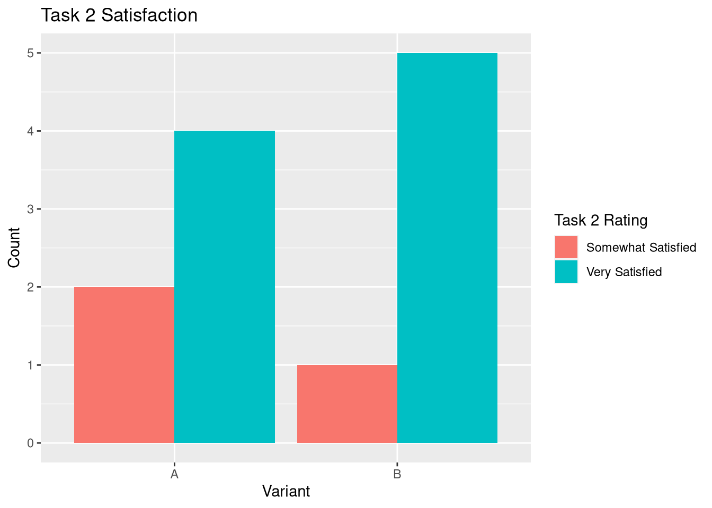
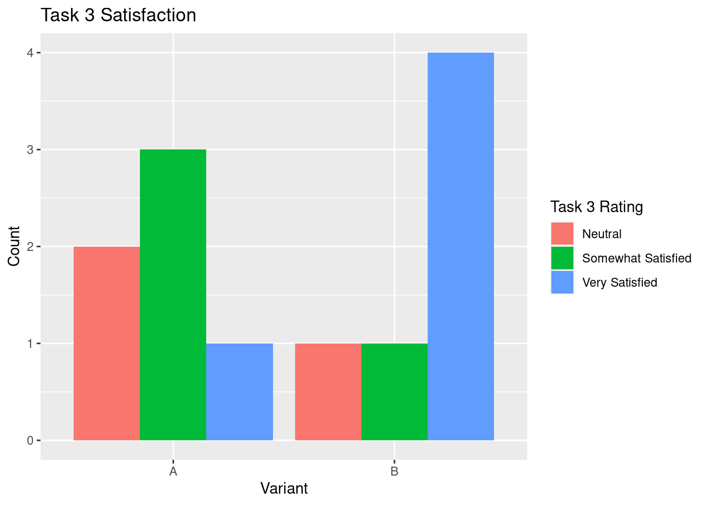

# Phase III: Prototypes and User Testing

## Introduction

Culinary Collab is a webapp aimed at bar and food service professionals, as well as the average at-home cook or home bar enthusiast. Storing drink and food recipes, the app aims to provide a sleeker method of sharing, storing, and finding recipes. During this phase of building the app, the UX team has embarked on the journey of actual user usability testing. 

## Methods

### Usability Test

During this phase, we ran usability tests after getting our protocols IRB approval. Our protocols can be found [here](../protocol/), which we recommend reading for additional context. As a part of the tests, we had a moderator reading instructions from the protocol to the participant, and a notetaker taking notes on statements and ratings given by the participant. As a part of the Usability Test, we provided participants with 3 tasks, on two variants of the [prototype](../prototypes/).

- Log into the Culinary Collab website.
- Find and edit the amount of Pineapple Juice in a Pina Colada. 
- Find and share a drink recipe with Bourbon in it.

Each of these tasks was designed to best test the efficacy of our decision to use icons instead of worded buttons in our prototype. If you look at the prototype, you'll notice that the login is the same in both variants, designed to give us a baseline task for them. The second and third tasks are more complex, with the second containing 1 major change, and the third containing 2 major changes. This methodology was chosen to check how well the user adapted to these changes, but also help us identify issues that may exist outside those elements.

Outside of the test itself, we acquired participants by asking other members of our Usability Engineering class to sign up for our session, aiming to target people with Food Service or Bartending experience.

## Findings

### Usability Test

In our Usability Test we had several findings:

- In our testing, Variant A and B were equally favored by different candidates.
- Participants that preferred A often cited B feeling like it had more clicks/was less straightforward.
- Sharing was the favorite feature of 5/6 participants.
- The sharing screen consistently confused participants, with them being unsure if it was a contacts menu or message history menu.

For raw data, here are some graphs comparing our variant's results:

It becomes clear looking at the data in this way that in the tasks that had changes, variant B resulted in higher satisfaction for users.

Our full data and findings are attached to this report [here](../data/).

## Conclusions

Based on each of the primary findings above, we've drawn a few conclusions:

- Variant A and B are negligibly different enough that it may come down to team preference on design elements.
- Variant B may need some more clear signage when possible.
- Sharing is an important and appreciated feature, but needs improvement of the actual share workflow.

Were the project to continue from here, each of these findings could be used to greatly improve the user appeal. Moving forwards with variant B seems like the right choice based on our feedback, but in some places may require more clear icons, which could spawn the need for more user testing. Additionally, the sharing menu confused several users. A reevaluation of the existing menu could yield better user understanding of the process, and provide a smoother experience.

## Caveats

It is important to acknowledge the limitations that come with our research methods. First and foremost is that all of our test subjects were drawn from the CSCI-431w class. This limits the demographics of our study substantially. As an example, while our preference was for people with food service experience, 1/3 of our participants had no experience in food service. This means that our data is not going to be as relevant to our target audience as we may have liked, but still can be used to garner good data about users.